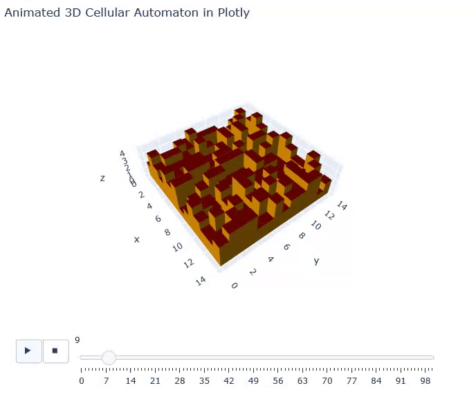

# plotly-cellular-automata
This project is a simple showcase of Plotly's 3D mesh and animation features, to make a small 3D cellular automata.

  

## Running the Example
You can run examples using the following command:

```bash
python -m examples.game_of_life
python -m examples.rabbits_on_terrain
python -m examples.opti_terrain
python -m examples.magic_terrain
```

# Acknowledgements
This project contains free models from Poly Pizza licenced under CC-BY (Poly by Google)